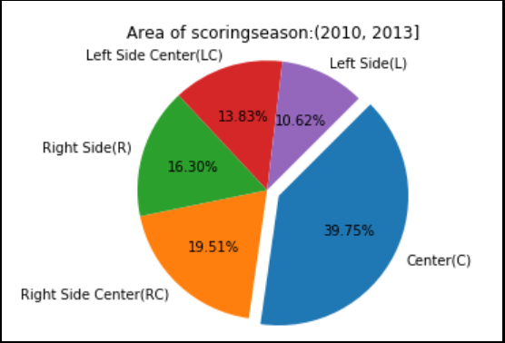

## Kick Off

Understand and gain insights of Cristinao Ronaldo's game behaviour using data science. The dataset used in this project is available at [Kaggle]( https://www.kaggle.com/kerneler/starter-cristiano7-43250438-1).

### Data Visualizations

Below are the major data visualizations done for different features of the dataset.

### 1. Area to score goals from

### 2. Distance of shots against the amount of time left

### 3. Which Season saw Ronaldo scoring most goals

### Prediction model

Predicting if the goal will be scored or not using a binary classification Artifical Neural Network. Used Numpy, Pandas, Scikit-learn and Keras for the same. Jupyer notebook "predictions.ipynb" contains the code for tranforming the data and building the model.

